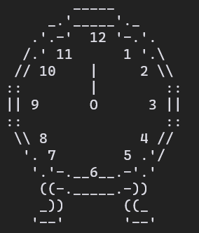
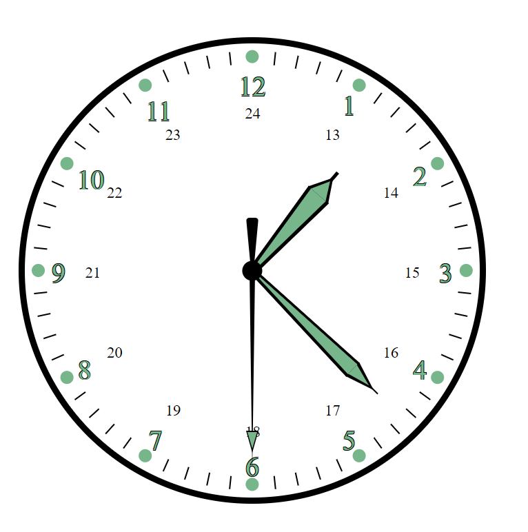

# Clock

|  |  |
| - | - |

A simple way to tell the time

## Command line

A command line program to display the time in multiple formats. Some options include digital/analog, and ncurses/printed display.

### Options

| Flag   | Description                                                     |
| ------ | --------------------------------------------------------------- |
| **-h** | Display a list of options (help).                               |
| **-a** | Analog clock, this is the default.                              |
| **-d** | Digital watch clock face. This is easier to read but less cool. |
| **-c** | Analog clock with a more circular design.                       |
| **-n** | Use Ncurses to display the time instead of printing.            |
| **-p** | Print the time to stdout. This is the default.                  |
| **-x** | Add a custom time. `./clock.py -x 12 00`                        |
| **-t** | Just print the current time.                                    |

## Web

A working HTML representation of a watch face
